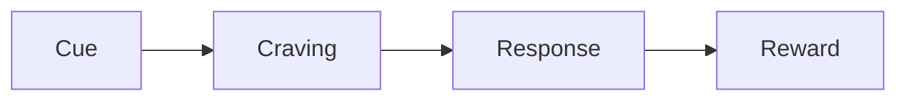

# Hyday Markdown Skill

> **First time in this conversation? Run Step 0 from `hyday-vault-layout` to find the vault root.** This skill assumes you already know where the user's Hyday folder lives on disk. Resolve it from `~/Library/Application Support/Hyday/settings.json` (macOS) or `%APPDATA%\Hyday\settings.json` (Windows) — `journalPath` field. Don't guess, don't write to `~/Documents/Hyday`, and don't ask the user unless the config file lookup fails.

Hyday stores every note as a plain `.md` file on disk. The app picks up changes automatically — write the file, and the note appears in Hyday next time it scans. This skill covers Hyday's extensions on top of standard Markdown.

> Assumed knowledge: CommonMark + GFM (headings, lists, tables, code blocks, task lists `- [ ]`). Only Hyday-specific syntax is documented here.

## Workflow: Creating a Hyday Note

1. **Pick the right file name**. Notes use any descriptive filename ending in `.md`. Avoid names that look like a date (`YYYY-MM-DD.md`, `YYYY.MM.DD.md`) unless the file is meant to be a [[journal entry]] — Hyday auto-detects those as the `journal` type. See `hyday-vault-layout` for where the file goes.
2. **Write frontmatter** at the top of the file using YAML between `---` fences. Always quote string values with double quotes.
3. **Pick a `type`** from `article | card | img | link | video`. Default is `article` if omitted. Journal files do not use `type` — Hyday infers `journal` from the filename.
4. **Write the body** in Markdown. Add `#tag`, `@(Label)`, and `[[note-id]]` inline as needed.
5. **Save** the file. Hyday reindexes within a few seconds.

## Frontmatter

```yaml
---
title: "Reading notes — Atomic Habits"
type: "article"
createdAt: "2026-05-17 09:30:00"
lastModified: "2026-05-17 09:30:00"
tags:
  - "books"
  - "habits"
pinned: true
---
```

> **Always write `createdAt` and `lastModified`.** Use the current real-world time when the agent creates the note. On a brand-new note both fields hold the same value; on edits, bump only `lastModified`. Skipping them means Hyday has no reliable creation time for sorting / display and the note will look orphaned in the timeline.

### Supported fields

| Field | Required? | Type | Description |
|-------|-----------|------|-------------|
| `title` | **required** | string | Display title. Don't rely on the filename — Hyday displays `title` in the note list and elsewhere. |
| `type` | **required** | enum | `article` \| `card` \| `img` \| `link` \| `video`. Omit ONLY for journal files (filename is a date). Do NOT write `note`, `journal`, `text`, or any other value. |
| `createdAt` | **required** | string | `YYYY-MM-DD HH:mm:ss` (24-hour, local time). Write the actual moment the agent is creating this note. Hyday uses this for sort / display; if missing, Hyday falls back inconsistently. |
| `lastModified` | **required** | string | `YYYY-MM-DD HH:mm:ss`. On creation, set this to the same value as `createdAt`. On edits, update to the current time. |
| `tags` | optional | list of strings | YAML list, each item double-quoted. Merged with inline `#tag`s for the note's full tag set. |
| `pinned` | optional | boolean | Pin to the top of the note list. |
| `archived` | optional | boolean | Hide from the main list (still searchable). |
| `sourceUrl` | string | For `link` / `video` notes — the original URL. |
| `sourceTitle` | string | The page's `<title>` or og:title. |
| `sourceDomain` | string | The page's hostname. |
| `sourceDescription` | string | Short summary / og:description. |
| `sourceImage` | string | Preview image URL. |
| `sourceEmbedUrl` | string | Embeddable URL (YouTube `/embed/...` etc.) for `video` notes. |
| `capturedAt` | string | When the source URL was first captured. |

### Quoting rules

- **Always wrap string values in double quotes** — Hyday's frontmatter parser is conservative and unquoted values with `:`, `#`, `-`, or other YAML-special characters will break.
- **Escape `"` inside strings** as `\"`. Example: `title: "She said \"hello\""`.
- **Tag list items** use the dashed form, each quoted: `  - "books"`.

### Note types — when to use which

| Type | Used for | Notes |
|------|----------|-------|
| `article` | Long-form writing, meeting notes, essays | Default. Body is the main content. |
| `card` | Short atomic ideas, quick captures | Body is brief; surfaced compactly in card views. |
| `img` | Image-centric notes | First image in body is the cover. |
| `link` | Saved web pages | Set `sourceUrl`, `sourceTitle`, `sourceDomain`. |
| `video` | Saved videos | Set `sourceUrl` and `sourceEmbedUrl` (e.g. `https://www.youtube.com/embed/<id>`). |
| `journal` | Daily journal entries | **Do not set in frontmatter** — Hyday infers from filename. See `hyday-lifelog`. |

## Inline Tags

```markdown
#reading                 Single tag
#books/non-fiction       Nested tag (slash creates hierarchy)
#project-alpha           Hyphens and letters allowed
```

**Rules**:

- Must start with a letter (not a digit) after `#`.
- Can contain letters, digits, `_`, `-`, `/`.
- Tags inside fenced code blocks (` ``` `) or inline code (`` ` ``) are **not** parsed — useful when documenting `#hex` colors or shell prompts.
- Tags can also be set in frontmatter (`tags:` list). The displayed tag set is the union of both.

## Inline Entities

Entities are people, places, projects — anything you want to track separately from a free-form tag. They render as a styled chip.

```markdown
Met with @(Aaron) about the launch.
Project @(Alpha Launch) is on track.
```

**Syntax**: `@(Label)` — parentheses, label can contain spaces and most characters except `)`.

**Legacy syntax**: `@{Label}` is still accepted and will be migrated to `@(Label)` on next save. Always write new content in the parenthesis form.

**Boundary rule**: `@(...)` must follow whitespace, CJK punctuation, or be at the start of a line. `email@(domain)` won't be parsed as an entity because `email` is right next to `@`.

## Backlinks (Wikilinks)

```markdown
[[2026-05-17]]                      Link to a journal entry by date
[[Reading notes — Atomic Habits]]   Link to a note by title or id
[[note-id|Display Text]]            Custom display text
```

**How they resolve**:

- Hyday matches against note `title` first, then filename (without `.md`).
- For journal entries, use the date in `YYYY-MM-DD` form.
- If multiple notes match, the most recently modified wins — disambiguate by using a more specific title.

**No heading or block anchors** — unlike Obsidian, Hyday does not support `[[Note#Heading]]` or `[[Note#^block-id]]`.

## Standard Markdown — Hyday-supported features

Hyday's editor (Plate.js) supports:

- **GFM**: tables, task lists (`- [ ]`), strikethrough, fenced code blocks
- **Math**: inline `$e^{i\pi}+1=0$` and block `$$ ... $$`
- **Mermaid diagrams**: ```` ```mermaid ```` fenced blocks
- **Callouts** (same syntax as Obsidian/GitHub):

```markdown
> [!note]
> Basic callout.

> [!warning] Custom title
> Callout body.

> [!tip]- Collapsed callout
> Click to expand.
```

Common callout types: `note`, `tip`, `warning`, `info`, `important`, `caution`, `success`, `failure`, `question`, `example`, `quote`, `todo`.

## Code blocks

Fenced code blocks render with syntax highlighting:

````markdown
```typescript
const greeting = "hello";
```
````

`#tags`, `@(entities)`, and life log marks inside code blocks are **not** parsed — code stays literal.

## Complete Example

```markdown
---
title: "Atomic Habits — Chapter 3 notes"
type: "article"
tags:
  - "books"
  - "habits"
pinned: false
---

# Atomic Habits — Chapter 3

Reading session on 2026-05-17 with @(Aaron). Tracked under #books/non-fiction.

## Key idea

Identity-based habits > outcome-based habits. See [[Reading notes — Atomic Habits]] for the full overview.

> [!tip] Quote
> "You do not rise to the level of your goals. You fall to the level of your systems."

## Open questions

- [ ] How does this apply to writing routines?
- [ ] Compare with [[Deep Work]] approach.

## Diagram


```

## Validation checklist

After writing or editing a `.md` file, verify:

1. Frontmatter is wrapped in `---` fences with valid YAML inside.
2. All string values are double-quoted.
3. **`title` is set** (don't rely on filename — Hyday displays this).
4. **`type` is set** to one of: `article`, `card`, `img`, `link`, `video`. Do **not** set `type: "journal"`, `note`, `text` — let the filename do it for journals, and use one of the five enum values for everything else.
5. **`createdAt` AND `lastModified` are both set** in `YYYY-MM-DD HH:mm:ss` 24-hour format. On a new note they should be equal. Skipping them means the note has no reliable timestamp and looks orphaned in Hyday's UI.
6. Tags follow the rules (start with a letter after `#`, no spaces).
7. Entities use `@(Label)` form; convert any legacy `@{Label}` if you spot them.
8. Backlinks reference notes that exist (or that the user intends to create).
9. Filenames for journal entries match `YYYY-MM-DD.md` or `YYYY.MM.DD.md`; everything else is a regular note.

## References

- Hyday vault layout: see `hyday-vault-layout` skill
- Journal-specific syntax: see `hyday-lifelog` skill
- Whiteboard cards: see `hyday-whiteboard` skill
